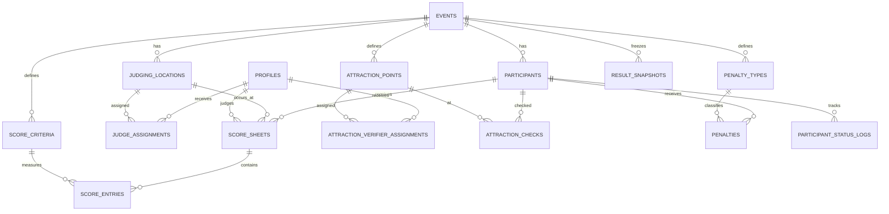

# ARCHITECTURE — Sistem Penjurian Karnaval

> Stack tetap: Angular 18 + Express + TypeScript + Node.js 22 + Supabase.
> Sasaran: modular monolith, mudah dieksekusi Codex, cukup kuat untuk operasional event tanpa microservice.

## 0. Keputusan arsitektur

- Monorepo npm workspaces.
- Angular sebagai SPA/PWA.
- Express sebagai API utama untuk seluruh mutasi dan perhitungan sensitif.
- Supabase untuk PostgreSQL, Auth, dan Storage opsional.
- Database menjadi source of truth.
- Shared contract TypeScript untuk DTO/enums.
- REST API; tidak memakai GraphQL.
- Modular monolith; tidak memakai microservice/event broker.
- Realtime hanya untuk dashboard/status yang membutuhkan pembaruan langsung.
- Offline penuh bukan target; draft lokal + retry terbatas adalah target.

## 1. Struktur repository

```text
/
├─ apps/
│  ├─ web/                     # Angular 18
│  └─ api/                     # Express TypeScript
├─ packages/
│  └─ contracts/               # DTO, enums, shared types; tanpa logic server
├─ supabase/
│  ├─ migrations/
│  ├─ seed.sql
│  └─ config.toml
├─ docs/
│  ├─ PRD.md
│  ├─ TASKS.md
│  ├─ DESIGN.md
│  └─ ARCHITECTURE.md
├─ package.json
├─ tsconfig.base.json
├─ .env.example
└─ README.md
```

## 2. Batas tanggung jawab

### Angular

- Rendering UI.
- Client-side route guard untuk UX.
- Typed forms.
- Draft state lokal.
- Memanggil API.
- Menampilkan realtime progress.
- Tidak menghitung hasil resmi.
- Tidak memakai service-role key.
- Tidak mengandalkan guard sebagai keamanan utama.

### Express API

- Verifikasi JWT Supabase.
- Otorisasi berbasis role dan assignment.
- Validasi input.
- Transaction boundary.
- Perhitungan skor resmi.
- Idempotency submit.
- Audit log.
- Export data.
- Penggunaan service-role hanya bila benar-benar diperlukan.

### Supabase/PostgreSQL

- Persistensi.
- Constraint dan index.
- RLS defense-in-depth.
- Auth identity.
- Trigger terbatas untuk `updated_at`/proteksi penting.
- View/read model untuk rekap bila membantu.
- Storage untuk evidensi opsional.

## 3. Modul backend

```text
apps/api/src/modules/
├─ auth/
├─ users/
├─ events/
├─ participants/
├─ locations/
├─ judge-assignments/
├─ scoring/
├─ attractions/
├─ penalties/
├─ operations/
├─ results/
├─ exports/
└─ audit/
```

Setiap modul minimal:

```text
<module>/
├─ routes.ts
├─ controller.ts
├─ service.ts
├─ repository.ts
├─ schema.ts
└─ types.ts
```

Aturan:

- Controller tipis.
- Business rules di service.
- Query SQL/data access di repository.
- Validasi request di schema.
- Tidak membuat generic repository.
- Hindari circular dependency.

## 4. Modul frontend

```text
apps/web/src/app/
├─ core/
│  ├─ auth/
│  ├─ api/
│  ├─ guards/
│  ├─ interceptors/
│  └─ layout/
├─ shared/
│  ├─ ui/
│  ├─ pipes/
│  └─ utils/
├─ features/
│  ├─ dashboard/
│  ├─ participants/
│  ├─ judging/
│  ├─ operations/
│  ├─ attractions/
│  ├─ penalties/
│  ├─ results/
│  ├─ users/
│  └─ settings/
└─ app.routes.ts
```

Gunakan:

- Standalone components.
- Signals untuk local/view state.
- RxJS untuk async stream, HTTP, dan realtime.
- Reactive Forms.
- Lazy-loaded feature routes.
- Smart page + presentational component seperlunya.
- Hindari global state library pada MVP kecuali kebutuhan nyata muncul.

## 5. Model data

Semua primary key memakai UUID kecuali nomor urut bisnis.

### 5.1 `profiles`

```text
id uuid PK -> auth.users.id
full_name text
role enum(super_admin, admin, judge, operator, viewer)
is_active boolean
created_at timestamptz
updated_at timestamptz
```

### 5.2 `events`

```text
id uuid PK
name text
year int
event_date date
timezone text default 'Asia/Jakarta'
status enum(draft, configured, scoring_open, scoring_closed, published, archived)
normal_performance_minutes int default 10
finish_extra_minutes int default 4
aggregation_method enum(average, sum)
rounding_scale smallint
attraction_mode enum(compliance_only, fixed_points)
attraction_point_value numeric
config_locked_at timestamptz null
published_at timestamptz null
created_by uuid
created_at timestamptz
updated_at timestamptz
```

### 5.3 `participant_categories`

```text
id uuid PK
event_id uuid FK
code text
name text
sort_order int
unique(event_id, code)
```

Seed: `EDUCATION`, `GENERAL`.

### 5.4 `participants`

```text
id uuid PK
event_id uuid FK
category_id uuid FK
sequence_number int
name text
theme text null
coordinator_name text null
coordinator_phone text null
member_count int
scheduled_departure_at timestamptz null
estimated_finish_at timestamptz null
actual_departure_at timestamptz null
actual_finish_at timestamptz null
status enum(registered, standby, called, performing, departed, arrived, completed, issue, withdrawn)
exception_reason text null
notes text null
is_active boolean
created_at timestamptz
updated_at timestamptz
unique(event_id, sequence_number)
```

Constraint aplikasi/database: `member_count >= 30` atau `exception_reason` wajib.

### 5.5 `judging_locations`

```text
id uuid PK
event_id uuid FK
code text
name text
address_note text null
sort_order int
is_active boolean
unique(event_id, code)
```

Seed: `START`, `GEDANGMAS_B_EDI`, `FINISH`.

### 5.6 `judge_assignments`

```text
id uuid PK
event_id uuid FK
judge_id uuid FK profiles
location_id uuid FK
assigned_at timestamptz
revoked_at timestamptz null
assigned_by uuid
```

Partial unique index: satu assignment aktif per juri/event dan satu juri utama aktif per lokasi pada MVP.

### 5.7 `score_criteria`

```text
id uuid PK
event_id uuid FK
code text
name text
description text
max_score numeric
sort_order int
is_active boolean
unique(event_id, code)
```

Total `max_score` aktif harus 100 sebelum scoring dibuka.

### 5.8 `score_sheets`

```text
id uuid PK
event_id uuid FK
participant_id uuid FK
location_id uuid FK
judge_id uuid FK
status enum(draft, submitted, unlocked, waived)
total_score numeric
general_note text null
version int default 1
submitted_at timestamptz null
unlocked_at timestamptz null
unlock_reason text null
updated_at timestamptz
unique(event_id, participant_id, location_id)
```

`judge_id` harus sesuai assignment saat sheet dibuat. Histori perubahan disimpan di audit/snapshot.

### 5.9 `score_entries`

```text
id uuid PK
score_sheet_id uuid FK
criterion_id uuid FK
score numeric
note text null
updated_at timestamptz
unique(score_sheet_id, criterion_id)
```

Constraint: `0 <= score <= criterion.max_score` ditegakkan service dan transaction/database function.

### 5.10 `attraction_points`

```text
id uuid PK
event_id uuid FK
code text
name text
address_note text
sort_order int
point_value numeric null
is_active boolean
```

### 5.11 `attraction_verifier_assignments`

```text
id uuid PK
event_id uuid FK
operator_id uuid FK profiles
attraction_point_id uuid FK
assigned_at timestamptz
revoked_at timestamptz null
assigned_by uuid
```

Partial unique index: satu assignment aktif per operator/event dan satu Attraction
Verifier aktif per titik pada MVP.

### 5.12 `attraction_checks`

```text
id uuid PK
event_id uuid FK
participant_id uuid FK
attraction_point_id uuid FK
status enum(performed, not_performed, unable_to_verify)
verified_by uuid
verified_at timestamptz
note text null
evidence_path text null
unique(event_id, participant_id, attraction_point_id)
```

### 5.13 `penalty_types`

```text
id uuid PK
event_id uuid FK
code text
name text
default_deduction numeric
requires_approval boolean
is_active boolean
```

### 5.14 `penalties`

```text
id uuid PK
event_id uuid FK
participant_id uuid FK
penalty_type_id uuid FK
deduction numeric
reason text
occurred_at timestamptz
status enum(draft, confirmed, cancelled)
recorded_by uuid
confirmed_by uuid null
confirmed_at timestamptz null
cancelled_by uuid null
cancelled_at timestamptz null
created_at timestamptz
```

### 5.15 `participant_status_logs`

```text
id uuid PK
event_id uuid FK
participant_id uuid FK
from_status text null
to_status text
note text null
recorded_by uuid
recorded_at timestamptz
```

### 5.16 `result_snapshots`

```text
id uuid PK
event_id uuid FK
version int
calculation_config jsonb
results jsonb
created_by uuid
created_at timestamptz
published_at timestamptz null
unique(event_id, version)
```

Snapshot memastikan hasil yang diterbitkan tidak berubah diam-diam.

### 5.17 `audit_logs`

```text
id bigint generated always as identity PK
event_id uuid null
actor_id uuid null
action text
entity_type text
entity_id text null
before_data jsonb null
after_data jsonb null
metadata jsonb null
created_at timestamptz
```

Append-only melalui API/database policy.

## 6. Relasi utama



## 7. API contract

Prefix: `/api/v1`

### Auth/profile

```text
GET    /me
```

### Events/config

```text
GET    /events/:eventId
PATCH  /events/:eventId
POST   /events/:eventId/readiness-check
POST   /events/:eventId/open-scoring
POST   /events/:eventId/close-scoring
```

### Participants

```text
GET    /events/:eventId/participants
POST   /events/:eventId/participants
POST   /events/:eventId/participants/import
GET    /participants/:participantId
PATCH  /participants/:participantId
PATCH  /participants/:participantId/status
```

### Assignments/scoring

```text
GET    /events/:eventId/my-assignment
GET    /events/:eventId/my-score-sheets
GET    /score-sheets/:sheetId
PUT    /score-sheets/:sheetId/draft
POST   /score-sheets/:sheetId/submit
POST   /score-sheets/:sheetId/unlock
POST   /score-sheets/:sheetId/waive
GET    /events/:eventId/scoring-progress
```

### Attractions/penalties

```text
GET    /events/:eventId/attraction-checks
PUT    /participants/:participantId/attraction-checks/:pointId
GET    /events/:eventId/penalties
POST   /events/:eventId/penalties
POST   /penalties/:penaltyId/confirm
POST   /penalties/:penaltyId/cancel
```

### Results

```text
GET    /events/:eventId/results/preview
POST   /events/:eventId/results/snapshot
POST   /events/:eventId/results/publish
GET    /public/events/:eventId/results
GET    /events/:eventId/exports/results.csv
```

Gunakan response envelope sederhana:

```json
{
  "data": {},
  "meta": {},
  "error": null
}
```

Error:

```json
{
  "data": null,
  "error": {
    "code": "SCORE_SHEET_LOCKED",
    "message": "Nilai telah dikirim dan dikunci.",
    "details": {}
  }
}
```

## 8. Perhitungan nilai

Perhitungan harus berada dalam satu service transaction atau database function yang diuji.

```text
judge_total(location) = SUM(score_entries.score)
aggregate =
  average ? AVG(submitted judge_total)
          : SUM(submitted judge_total)

attraction_total =
  compliance_only ? 0
                  : SUM(point_value untuk performed)

penalty_total = SUM(deduction untuk confirmed)

final_score = GREATEST(0, aggregate + attraction_total - penalty_total)
```

Rules:

- Draft tidak dihitung.
- Waiver diperlakukan sesuai keputusan OD-04.
- Preview menampilkan alasan incomplete.
- Sorting memakai `final_score DESC` lalu tie-break config.
- Snapshot menyimpan config dan hasil perhitungan.

## 9. Konsistensi, concurrency, dan idempotency

- Draft memakai optimistic concurrency melalui `version`.
- Update gagal dengan `409 VERSION_CONFLICT` bila versi basi.
- Submit menerima `Idempotency-Key`.
- Submit memvalidasi semua kriteria dan total.
- Unlock membuat audit snapshot.
- Perubahan status event dan publish menggunakan transaction.
- Unique constraints mencegah sheet/check ganda.

## 10. Auth dan RLS

JWT claims utama berasal dari Supabase Auth; role authoritative dibaca dari `profiles`.

Prinsip policy:

- User membaca profil sendiri.
- Judge membaca event, participant, criteria, location yang aktif.
- Judge membaca/mengubah score sheet miliknya sesuai assignment.
- Judge tidak membaca score sheet juri lain saat scoring berlangsung.
- Operator membaca peserta dan menulis status/check sesuai hak.
- Admin mengelola data event.
- Public hanya membaca result snapshot published melalui view/endpoint aman.
- Browser sebaiknya memakai API Express untuk mutasi; RLS tetap aktif sebagai lapisan tambahan.

## 11. Realtime

Gunakan Supabase Realtime hanya untuk:

- perubahan status peserta
- progres submit score sheet
- perubahan checklist atraksi
- status event

Jangan realtime-kan audit log atau seluruh score entries ke semua client.

Fallback: polling 15–30 detik pada dashboard bila channel gagal.

## 12. PWA dan jaringan lapangan

- Angular PWA shell cache.
- Jangan cache response sensitif lintas akun.
- Draft tersimpan di IndexedDB dengan key:
  `eventId + sheetId + judgeId + version`.
- Queue hanya untuk simpan draft, bukan submit final.
- Submit final harus menerima respons server.
- Tampilkan status: online, offline, syncing, synced, conflict.
- Hapus draft lokal setelah submit sukses.

## 13. Logging dan observability

- Structured JSON logs di API.
- Request ID setiap request.
- Log actor ID, route, status, duration; tanpa token/password.
- Central error handler.
- Health endpoints:
  - `/health/live`
  - `/health/ready`
- Audit log bukan pengganti application log.

## 14. Testing

### Unit

- Validasi skor.
- Total rubrik.
- Agregasi average/sum.
- Atraksi.
- Penalti.
- Tie-break.
- State transition event.
- Role/assignment authorization.

### Integration

- Judge hanya menilai lokasi sendiri.
- Submit idempotent.
- Submitted sheet terkunci.
- Unlock menghasilkan audit.
- Hasil incomplete tidak dapat dipublish.
- Snapshot tidak berubah setelah publish.
- RLS negatif untuk akses lintas role.

### E2E

- Admin setup → open scoring.
- Tiga juri mengisi nilai.
- Operator mengisi atraksi/status.
- Admin konfirmasi penalti.
- Admin preview → publish.
- Viewer melihat hasil publik.

## 15. Environment variables

```dotenv
# web
WEB_BASE_URL=
API_BASE_URL=
SUPABASE_URL=
SUPABASE_ANON_KEY=

# api
PORT=3000
NODE_ENV=development
CORS_ORIGINS=http://localhost:4200
SUPABASE_URL=
SUPABASE_ANON_KEY=
SUPABASE_SERVICE_ROLE_KEY=
DATABASE_URL=
LOG_LEVEL=info
```

- `.env` tidak di-commit.
- Sediakan `.env.example` tanpa nilai rahasia.
- Validasi env saat startup.

## 16. Definition of Done teknis

- TypeScript strict aktif.
- Tidak ada `any` tanpa alasan.
- Lint dan format lulus.
- Migration reproducible dari database kosong.
- Seed event demo tersedia.
- Unit/integration test aturan kritis lulus.
- Production build web/api lulus.
- RLS diuji dengan role berbeda.
- Tidak ada secret di bundle frontend.
- Dokumentasi endpoint dan keputusan terbuka diperbarui.
